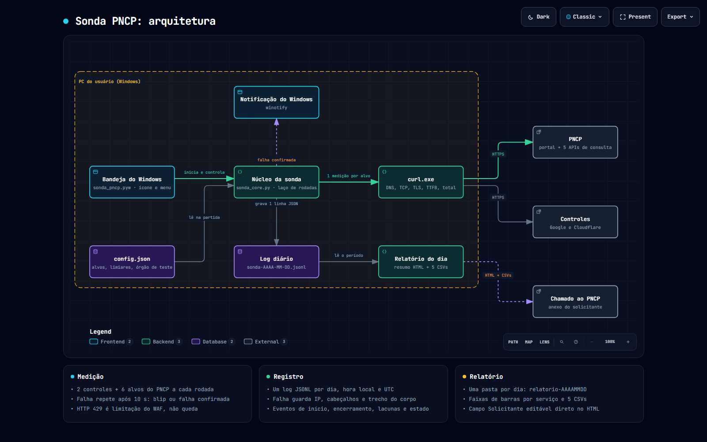
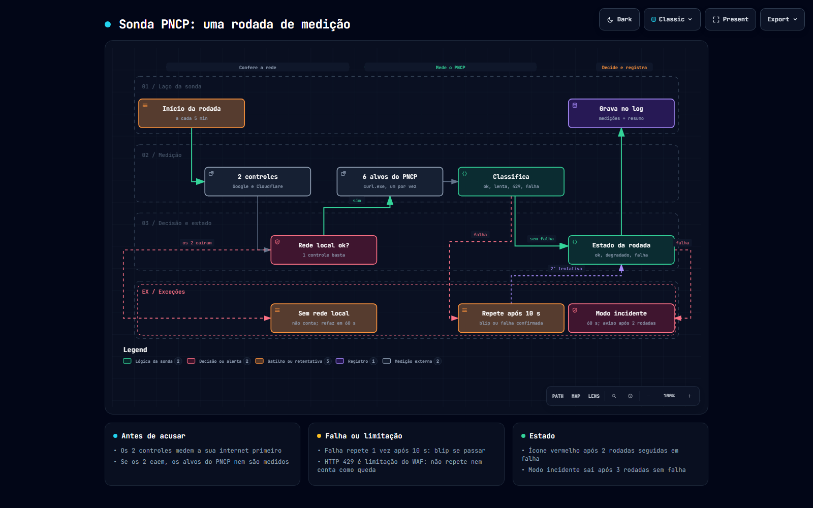

# Sonda PNCP

 [](https://github.com/devtulio/sonda-pncp/actions/workflows/ci.yml)    

Sonda de disponibilidade do PNCP (Portal Nacional de Contratações
Públicas): roda em segundo plano no Windows, com ícone na bandeja, mede
o portal e as APIs de consulta a cada 5 minutos e grava um log por dia.
O objetivo é ter **evidência própria, datada e defensável** da
instabilidade do PNCP, pra anexar a um chamado ou reclamação formal.

Referência completa: [MANUAL.md](MANUAL.md). Histórico:
[CHANGELOG.md](CHANGELOG.md). O que é contrato, como a versão muda e
como sai release: [RELEASING.md](RELEASING.md).

**Fronteira:** a sonda só **mede e registra**. Não coleta dados do PNCP
pra uso de negócio (isso é o [motor_pncp](https://github.com/devtulio/motor-pncp)),
não corrige nem reenvia nada, e não sabe de banco de dados. Mede de **um
único ponto de observação** e só com o computador ligado — a ausência de
registro aparece como lacuna no relatório, nunca como disponibilidade.

O que mede a cada rodada: 2 controles de internet (Google, Cloudflare) e
6 alvos do PNCP — o portal (`/app/`) e 5 endpoints públicos (contratações,
contratos, atas, PCA, itens da compra). Cada medição usa `curl.exe` e
guarda DNS, TCP, TLS, tempo até o primeiro byte e tempo total.

## Diagramas

A arquitetura (componentes e como conversam) e o fluxo de uma rodada de medição:





As imagens são capturas. Os arquivos [`docs/arquitetura.html`](docs/arquitetura.html) e
[`docs/rodada.html`](docs/rodada.html) são interativos (tema claro/escuro, zoom, busca,
modo apresentação): baixe e abra no navegador, porque o GitHub mostra HTML como código.
Foram feitos com o [Archify](https://github.com/tt-a1i/archify) (MIT) a partir das
especificações em [`docs/diagramas/`](docs/diagramas/); como regenerar: [MANUAL](MANUAL.md#diagramas).

## Uso

```bat
Iniciar Sonda PNCP.cmd     sobe na bandeja (segunda execução não duplica)
Encerrar Sonda PNCP.cmd    encerra a instância em execução
```

O ícone da bandeja muda de cor: **verde** = tudo ok, **amarelo** =
degradado ou 1 rodada com falha, **vermelho** = 2 rodadas seguidas com
falha (dispara notificação do Windows), **cinza** = sem rede local ou
pausada. Menu: Verificar agora, Abrir pasta de logs, Gerar relatório
(últimos 7 dias), Pausar sonda, Iniciar com o Windows, Encerrar.

Linha de comando (use o Python do `.venv`):

```bat
.venv\Scripts\python.exe sonda_pncp.pyw --uma-rodada    uma verificação, imprime o resultado
.venv\Scripts\python.exe sonda_pncp.pyw --relatorio 7   relatório dos últimos 7 dias
```

## Relatório para o chamado

`--relatorio N` (ou o menu do ícone) gera, em `relatorios/relatorio-AAAAMMDD/`,
**uma pasta por dia** — gerar de novo no mesmo dia sobrescreve, e sempre
lê os logs do período inteiro, então encerrar e reabrir a sonda não
fragmenta nada:

- `resumo_para_chamado.html` — uma página imprimível (A4) com cobertura,
  disponibilidade e latência por serviço, faixas de barras de
  estado/latência por serviço (como o statuslicitacoes), janelas de incidente, exemplos de falha com o horário
  do erro segundo o próprio PNCP e o método. Traz o campo
  `Solicitante`, um campo **editável direto na página** (clique, digite, imprima);
  o navegador lembra o texto nos próximos relatórios. Vazio, mostra um aviso
  vermelho — nada é enviado sozinho.
- 5 CSVs (`;`, UTF-8 com BOM, abrem direto no Excel): resumo diário,
  janelas de incidente, ocorrências, cobertura diária e lacunas.

Disponibilidade = (ok + lentas) / (ok + lentas + falhas), 1ª tentativa de
cada medição. HTTP 429 é limitação do WAF, **não queda**: fica fora da
conta e nunca acelera a sondagem. Detalhes em [MANUAL.md](MANUAL.md#relatório).

## Instalação

Requer Windows 10/11 (usa `curl.exe` do sistema) e Python 3.11+. Não há
instalador: a pasta é o programa.

```bat
python -m venv .venv
.venv\Scripts\python.exe -m pip install -r requirements.txt
Iniciar Sonda PNCP.cmd
```

Na primeira execução a sonda cria o `config.json` com os padrões e
registra o início automático com o Windows (atalho na pasta Startup do
usuário, sem administrador; desligável no menu).

Para medir o **seu** órgão em vez do de teste, troque `cnpj_teste` e
`compra_teste` no `config.json` (o [MANUAL](MANUAL.md#órgão-e-compra-de-teste)
mostra como achar uma compra).

Testes: `.venv\Scripts\python.exe -m unittest discover -s tests` (38
testes — medição real via `curl.exe` contra servidor HTTP falso,
classificação de erros, máquina de estados, lacunas, relatório).

## Princípios que o código segue

- **Falha ≠ ausência ≠ limitação.** Timeout, erro de rede, HTTP de erro e
  corpo inválido são falha; 429 é limitação do WAF; registro de teste que
  sumiu (404 explícito) é problema da sonda; nada disso se confunde.
- **O primeiro erro nunca é escondido.** Falha repete uma vez após 10 s;
  se a 2ª passa, é "blip" (estado degradado) — mas as duas tentativas
  ficam no log.
- **Controle antes de acusar.** Se os 2 controles de internet caem, a
  rodada é "sem rede" e os alvos do PNCP nem são medidos: falha da sua
  conexão não vira queda do PNCP.
- **Ausência de registro não é disponibilidade.** PC desligado ou
  suspenso vira lacuna explícita no relatório, com o motivo quando dá pra
  saber.
- **Evidência completa na falha.** Falha grava IP, cabeçalhos completos,
  trecho do corpo e o horário do erro segundo o próprio PNCP; sucesso
  grava só o hash do corpo.
- **A sonda nunca morre calada.** Erro interno vira evento no log e linha
  em `logs/sonda-erros.log`; o laço continua.
- **Mock não prova fronteira.** Mudança de comportamento é validada
  contra o PNCP real (`--uma-rodada`) antes de virar versão.

## Licença

[MIT](LICENSE) — © 2026 Túlio Ribeiro de Moura e Silva.
